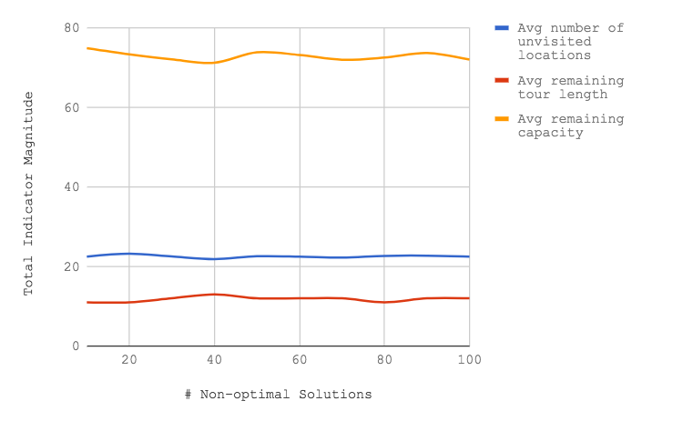
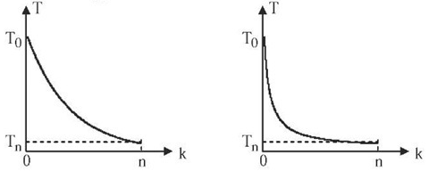
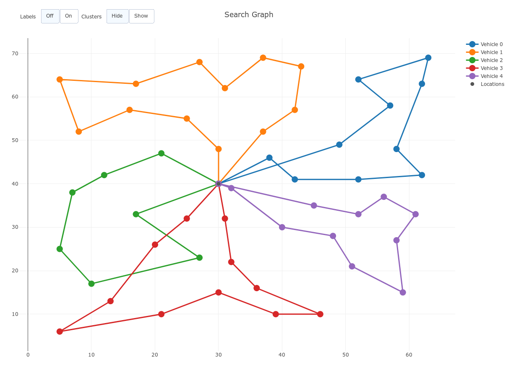

# Capacitated Vehicle Routing Problem
*Project for search and planning course*

## Introduction

This is a study on the alternatives to solve the Vehicle Routing Problem. We will analyze the results from different algorithms: a*, iterative sampling and simulated annealing.

## Data Structures

To model each state of the problem we chose to define a structure with the following fields:

|Field| Description|
|-|-:|
|vehicle-routes| An array of containing the route taken by each vehicle|
|current-vehicle| The id (index) of the vehicle that will choose the next location|
|transition-cost| Cost of transitioning to this state in terms of added distance|
|unvisited-locations| Hash table containing only keys with city ids|
|inserted-pair| Last customer added to route|
|number-unvisited-locations| The number of unvisited locations/customers|
|remaining-tour-length| An array that stores the remaining distance that each vehicle can still travel.|
|remaining-capacity| An array that stores the remaining cargo that each vehicle can still hold.|


We chose to utilize arrays as our primary data structure as opposed to lists due to their faster access time to a desired element, O(1) vs O(n).

We also utilized an Hash table to maintain the locations. This enabled us to easily keep track of the locations that we still needed to visit by removing locations that had already been visited from our hash.

## State Generators

During our attempts to improve our algorithms we developed 3 different state successor generators.
- ### Simple gen-successors:
	We started with a simple approach in which we iterated through all the unvisited locations in the current state and selected all locations that met distance and capacity constraints for the current vehicle.
- ### Insertion Method:
	This method iterated over all unvisited locations and tried to insert them in every possible location on each vehicle’s path. This proved to be unusable since it generated too many states. We also tried a mixed approach that only applied this method to the current active vehicle until his path could fit no more customers.
- ### Clustering Method:
	This method generates successors based on the clusters calculated by the Sweep algorithm. It translates all positions in a cluster to states. At each call of this function it verifies which position was inserted in a vehicle and removes it from the previous list of positions in the cluster, as to not generate duplicate states.

## Heuristics

We considered a set of heuristics that highlighted different properties of the problem.
Firstly, we considered Constructive Heuristics. This type of heuristics focuses on gradually building a feasible solution while keeping an eye on the solution cost.
- ### Insertion Cost Heuristic:
    It measures the total remaining route length for the vehicles of a given state.
	By itself, this heuristic did not produce optimal solutions.

After not being able to achieve any feasible solutions after running the a* algorithm with the previous heuristic, we decided to experiment with another category of heuristics, the Cluster-first, route-second Heuristics. We utilized these methods only to implement an optimized way to cluster our customers, according to their position and each vehicle's' maximum capacity.

- ### Fisher and Jaikumar Algorithm
	Our first try was the Fisher and Jaikumar Algorithm. We were not able to implement this clustering technique due to its high complexity and lack of easy to read documentation. We then understood that it didn’t meet the distance constraint so we considered another algorithm.

- ### Sweep algorithm
    The sweep algorithm groups customer locations based on their position relative to the depot location, and the capacity constraints for each vehicle. It measures the angle each customer location has relative to the depot location, it then orders this list of angles in an ascending fashion, and assigns each location to a vehicle until it reaches its maximum capacity. It does this for all available vehicles.
    To maximize the usage of  given a vehicle’s capacity, if a position on a neighbouring cluster still “fits” in the previous vehicle, we assign this position to the previous cluster.
## Cost Function
The cost function used is based on **Clark and Wright Method** and it determines the distanced added to a path C(i, j) when inserting k in between as follows:

```
C(i, j) = d(i,k) + d(k,j) - d(i,j)
```
where d(x,y) is the euclidean distance between x and y.

## Iterative Sampling:

This algorithm proved to be a bad solution for the Vehicle Routing Problem. Due to its random selection of a state, at each level of the search tree, it found partial solutions really fast but, from our testing, none would be even remotely close to the desired optimal solution where all customers are visited and capacity constraints are met. This was not able to achieved in the time and space constraints required by this project.


*Fig1: Iterative Sampling Statistics for first 100 non-optimal solutions*

In Fig1 we can see that the first 100 solutions found by the algorithm were, on average, 20 customer locations away from visiting all customers.

## Simulated Annealing:

To achieve the initial solution of the problem we tried a few naive methods. We started by constructing routes with the closest destination possible, which quickly proved to be infeasible, mainly due to distance constraints. We then tried to separate the customers in symmetric circular slices of space, i.e. each vehicle having the same search area and search space shape. Due to capacity constraints this also proved impossible.

After these attempts we realized that we needed a way to put customers in groups that didn’t exceed the maximum capacity, therefore we used the Sweep algorithm mentioned before to generate groups of customer locations. These groups are then assigned to each vehicle and added to their path by choosing the best place in the path that incurs less added distance.

The neighbor states are calculated using 2 permutation methods, interchange and shift. The shift method selects a customer from another vehicle’s path and adds it to the current path, if it does not break capacity and distance restrictions. The interchange method switches a customer from a vehicle’s path with another customer from another vehicle path, again, if it doesn’t break the restrictions.

The way the generated states are evaluated was through the summation of all the remaining lengths of the state of each vehicle.

The cooling functions tested are the following, with their respective graphical representation below:
- Exponential multiplicative cooling (left) 
- Logarithmic multiplicative cooling (right)   



Both cooling functions present similar results, however, since the initial state given has a really high value since it came from the sweep method we couldn’t see any noteworthy progression towards better states. However since the behavior of this function is heavily based on the cooling function used, we believe that with an exhaustive study of different αor T0values, different cooling functions and other neighbor generators we could have achieved better results

## Best Approach

This approach is the one used to achieve the initial state of the simulating annealing algorithm, used the before mentioned Sweep Algorithm to generate customer clusters and iteratively insert them into the best path position of its corresponding vehicle. Below we show the resulting path to the original problem given on the project description.



## Conclusion

We realized we weren’t getting close to the optimal solution of the vrp problem without applying the Sweep algorithm to group the positions into clusters. As expected the iterative sampling algorithm performed rather badly due to its random nature.  Simulated Annealing proved worse than expected and we regretted not having chosen the genetic algorithm approach that may have yielded better results.

## References

[VRP Web. (2017)](http://www.bernabe.dorronsoro.es/vrp/)

Osman, I. (1993). Metastrategy simulated annealing and tabu search algorithms for the vehicle routing problem. Annals of Operations Research, 41(4), pp.421-451.

[A Comparison of Cooling Schedules for Simulated Annealing (2017)](http://what-when-how.com/artificial-intelligence/a-comparison-of-cooling-schedules-for-simulated-annealing-artificial-intelligence/)

Toth, P. and Vigo, D. (2002). The vehicle routing problem. Philadelphia, Pa: SIAM.

Suresh Nanda Kumar and Ramasamy Panneerselvam (2012).  Survey on the Vehicle Routing Problem and Its Variants
